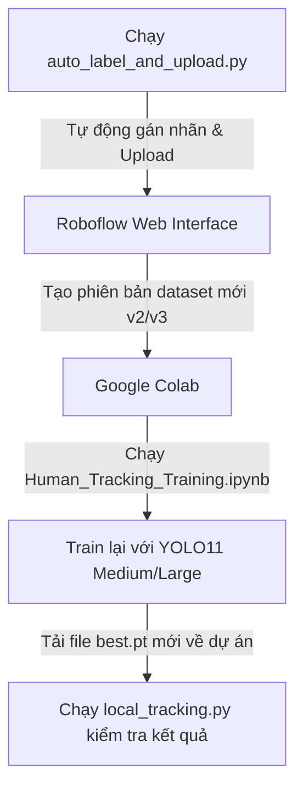

# 🎯 Hệ Thống Theo Dõi Người Chuyên Nghiệp (Human Tracking System)
### *Tối ưu hóa kiến trúc YOLOv11 & Bộ lọc Tracker chống nhảy ID*

Dự án chuyên nghiệp sử dụng kiến trúc **YOLOv11** (phiên bản mới nhất của Ultralytics) kết hợp với các bộ lọc theo vết tối tân **ByteTrack** và **BoT-SORT** để nhận diện, theo dõi, cấp ID duy nhất và đếm số lượng người thời gian thực. Hệ thống được tinh chỉnh để giải quyết triệt để lỗi nhảy ID (ID switching) khi đối tượng bị che khuất tạm thời hoặc di chuyển nhanh.

---

## 🌟 Tính Năng Nổi Bật

- **🎯 Nhận diện & Theo vết (Tracking)**: Cấp ID duy nhất cho từng người, đếm số người trong khung hình và hiển thị FPS thời gian thực.
- **🛡️ Công nghệ chống nhảy ID cực mạnh**: Tích hợp các bộ lọc Kalman Filter và kết hợp IoU chuyển động với tham số nâng cao giúp giữ ID đối tượng khi bị che khuất tối đa **4 giây (~120 frames)**.
- **🤖 Pipeline Auto-labeling Tự Động**: Tự động nhận diện, cắt khung hình từ video mới, xuất nhãn dạng YOLO và đẩy trực tiếp lên Roboflow để mở rộng tập dữ liệu.
- **💻 Tương thích 100% Windows & Linux**: Tự động xử lý ký tự đường dẫn đặc biệt trên Windows (ngăn lỗi unicode escape `\U`).
- **📊 Hỗ trợ Huấn luyện Lớn (YOLO11 Medium)**: Hướng dẫn cấu hình nâng cấp mô hình từ Nano (2.6M tham số) lên Medium (20.1M tham số) tăng vượt trội độ chính xác.

---

## 🛠️ Hướng Dẫn Cài Đặt Môi Trường (Windows/Linux)

Mở terminal trong thư mục dự án của bạn và chạy lệnh sau để cài đặt tự động tất cả các thư viện cần thiết (bao gồm cả PyTorch, Ultralytics, OpenCV, Roboflow):

```bash
python -m pip install -r requirements.txt
```

> [!NOTE]
> Quá trình cài đặt trên Windows có thể mất khoảng 2-3 phút để giải nén thư viện tính toán đồ họa PyTorch.

---

## 📂 Cấu Trúc Mã Nguồn Dự Án

```text
Human_Tracking/
├── Data/                       # Thư mục chứa các file video đầu vào (.mp4, .webm)
├── requirements.txt            # Danh sách thư viện bắt buộc để cài đặt dự án
├── custom_tracker.yaml         # Cấu hình ByteTrack tối ưu hóa (Khuyên dùng chống nhảy ID)
├── custom_botsort.yaml         # Cấu hình BoT-SORT cải tiến với bộ nhớ vết tăng gấp 4 lần
├── local_tracking.py           # Script chính để theo dõi người trên 1 video và lưu kết quả
├── auto_label_and_upload.py    # Script trích xuất ảnh tự động từ video mới và đẩy lên Roboflow
├── Human_Tracking_Training.ipynb # Notebook huấn luyện YOLO11 trên Google Colab
├── best.pt                     # Trọng số mô hình đã được huấn luyện tốt nhất (YOLO11 Medium)
└── README.md                   # Tài liệu hướng dẫn sử dụng chi tiết (File này)
```

---

## 🚀 Hướng Dẫn Vận Hành Hệ Thống

### 1. Chạy Theo Dõi Người (Human Tracking) trên Video
Mở file [local_tracking.py](file:///c:/Users/DELL/OneDrive%20-%20Hanoi%20University%20of%20Science%20and%20Technology/Desktop/Human_Tracking/local_tracking.py) để thiết lập cấu hình:

```python
# Thiết lập video đầu vào (sử dụng tiền tố r để tránh lỗi đường dẫn trên Windows)
VIDEO_SOURCE = r'C:\Users\DELL\OneDrive - Hanoi University of Science and Technology\Desktop\Human_Tracking\Data\Screen Recording 2026-04-08 172540.mp4'

# Chọn bộ lọc Tracker tại khối __main__:
TRACKER_CONFIG = 'custom_tracker.yaml'  # Sử dụng ByteTrack tối ưu (Khuyên dùng)
# HOẶC
TRACKER_CONFIG = 'custom_botsort.yaml'  # Sử dụng BoT-SORT cải tiến
```

Chạy chương trình bằng lệnh:
```bash
python local_tracking.py
```
> [!TIP]
> Khi đang chạy giao diện xem trực tiếp, bạn có thể nhấn phím **`q`** trên bàn phím để dừng tiến trình sớm bất cứ lúc nào. Video kết quả sẽ tự động lưu dưới tên `[Tên_Video_Gốc]_tracked.mp4` trong thư mục dự án của bạn.

---

## 💡 Bí Quyết Chống Nhảy ID (ID Switching Optimization)

Trong các bộ lọc mặc định của YOLO, thời gian lưu dấu đối tượng bị mất (do bị che khuất hoặc quay lưng) mặc định chỉ là **30 khung hình** (khoảng 1 giây ở video 30fps). Chúng tôi đã tùy chỉnh và tối ưu hóa hai file cấu hình tracker để giải quyết triệt để vấn đề này:

### A. Sử Dụng ByteTrack (`custom_tracker.yaml` - Khuyên dùng nhiều nhất)
ByteTrack giải quyết bài toán theo dõi bằng cách kết hợp cả các hộp nhận diện có độ tin cậy thấp (Low-score boxes) thay vì vứt bỏ chúng. Điều này cực kỳ hiệu quả khi người bị che khuất một phần.
* **`track_buffer: 120`**: Tăng thời gian lưu vết lên **120 khung hình (~4 giây)**. Người đi sau vật cản dưới 4 giây khi xuất hiện lại sẽ được khôi phục chính xác ID cũ.
* **`track_low_thresh: 0.1`**: Cho phép giữ vết khi điểm tự tin của đối tượng giảm mạnh (do mờ, quay lưng, góc tối).

### B. Sử Dụng BoT-SORT (`custom_botsort.yaml`)
BoT-SORT kết hợp các đặc trưng ngoại hình (Re-ID) và bù chuyển động camera (Global Motion Compensation - GMC).
* Sử dụng tốt khi camera bị rung lắc hoặc di chuyển liên tục.
* Thiết lập `with_reid: False` làm mặc định để giữ FPS ở mức cực cao, tránh quá tải khi không có GPU chuyên dụng.

---

## 🔄 Quy Trình Pipeline Đầy Đủ: Huấn Luyện & Mở Rộng Tập Dữ Liệu

Khi bạn muốn mô hình thông minh hơn và học được các dữ liệu mới trong tương lai:



### Bước 1: Trích xuất ảnh tự động từ video mới
Chạy script để tự động trích xuất các khung hình có người, gán nhãn định dạng YOLO và upload trực tiếp lên Roboflow của bạn:
```bash
python auto_label_and_upload.py
```
*Đường dẫn mặc định trong file này đã được chuyển sang dạng tương đối, tự động nhận diện thư mục lưu nhãn `./auto_labels`.*

### Bước 2: Tạo phiên bản mới trên Roboflow
Truy cập [Roboflow Dataset](https://app.roboflow.com/facedetection-uqkmv/human_26/browse?queryText=&pageSize=50&startingIndex=0&browseQuery=true). Bấm **Generate New Version** (ví dụ: Version `2` hoặc `3`) để hệ thống đóng gói tập dữ liệu mới nhất.

### Bước 3: Huấn luyện trên Google Colab
1. Upload file [Human_Tracking_Training.ipynb](file:///c:/Users/DELL/OneDrive%20-%20Hanoi%20University%20of%20Science%20and%20Technology/Desktop/Human_Tracking/Human_Tracking_Training.ipynb) lên Google Colab.
2. Chọn mô hình lớn hơn để tăng độ chính xác (ví dụ: `yolo11m.pt` - Medium 20M tham số).
3. Nhấp chạy toàn bộ Cell (Toàn bộ API Key và ID dự án đã được tôi cấu hình sẵn).
4. Tải file `best.pt` sau khi kết thúc huấn luyện về máy tính của bạn và ghi đè vào thư mục dự án.

---

## ❌ Hướng Dẫn Khắc Phục Lỗi Thường Gặp (Troubleshooting)

### 1. Lỗi `unicodeescape` khi khai báo đường dẫn video trên Windows
* **Biểu hiện**: Lỗi `SyntaxError: (unicode error) 'unicodeescape' codec can't decode...`
* **Khắc phục**: Thêm chữ **`r`** trước chuỗi đường dẫn video của bạn để chuyển thành raw string:
  ```python
  VIDEO_SOURCE = r'C:\Đường_Dẫn_Của_Bạn\video.mp4'
  ```

### 2. Lỗi `AttributeError: 'IterableSimpleNamespace' object has no attribute 'fuse_score'`
* **Biểu hiện**: Tracker bị crash ngay khi xử lý khung hình đầu tiên.
* **Nguyên nhân**: Thư viện `ultralytics` trên máy của bạn đã được cập nhật lên bản mới và đòi hỏi các cấu hình tracker phải có đủ tham số mặc định.
* **Khắc phục**: Tôi đã cập nhật lại đầy đủ 100% các tham số cấu hình này trong file `custom_tracker.yaml` và `custom_botsort.yaml`. Hãy đảm bảo bạn sử dụng hai file cấu hình này thay vì file tự viết tắt.

### 3. Lỗi không mở được file kết quả `_tracked.mp4`
* **Biểu hiện**: Nhấp vào file video trong VS Code hoặc Windows Media Player báo lỗi corrupt hoặc không xem được.
* **Nguyên nhân**: Tiến trình Python ghi video ngầm đang chạy và chưa đóng file hoàn chỉnh, hoặc bạn vừa tắt tiến trình đột ngột khiến file video bị lỗi cấu trúc đóng gói.
* **Khắc phục**: 
  - Hãy đợi cho đến khi chương trình chạy hết video và thông báo `Processing complete`.
  - Nếu muốn kết thúc sớm mà vẫn lưu được video, hãy nhấn phím **`q`** tại cửa sổ hiển thị video để OpenCV tiến hành đóng gói (finalise file) và lưu đúng cách trước khi thoát.

---
*Bản tài liệu cập nhật chi tiết và tối ưu hóa hệ thống - 2026*
