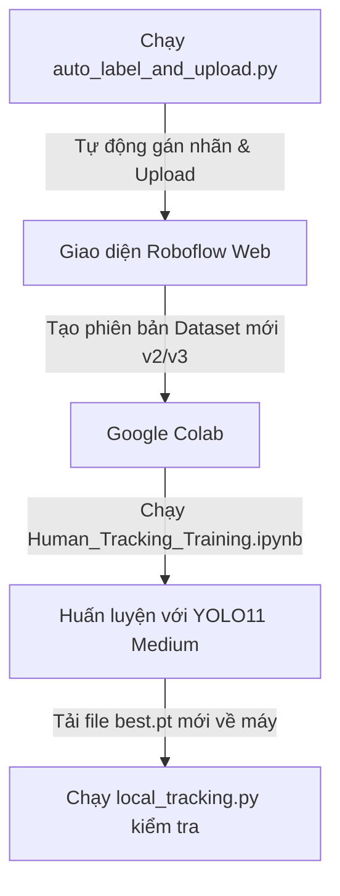

# Hệ thống Nhận diện và Theo dõi Đối tượng (Human Tracking System)

### Thiết lập mô hình YOLOv11 kết hợp thuật toán ByteTrack & BoT-SORT chống nhảy ID đối tượng

Dự án phát triển ứng dụng nhận diện, gán nhãn, theo dõi hành trình và đếm số lượng người di chuyển trong khung hình dựa trên mô hình học sâu **YOLOv11** (Ultralytics). Hệ thống tích hợp các thuật toán lọc vết **ByteTrack** và **BoT-SORT** được tinh chỉnh đặc biệt để khắc phục lỗi nhảy ID đối tượng (ID switching) khi xảy ra hiện tượng che khuất tạm thời hoặc di chuyển tốc độ cao.

---

## 1. Các tính năng của hệ thống

* **Nhận diện và theo dõi đối tượng (Object Tracking):** Định danh duy nhất (cấp ID không đổi) cho từng đối tượng trong khung hình, đếm số lượng người thực tế và đo tốc độ khung hình (FPS) thời gian thực.
* **Cơ chế chống nhảy ID đối tượng:** Tùy biến bộ lọc Kalman Filter kết hợp ngưỡng đánh giá IoU chuyển động để lưu trữ dấu vết đối tượng bị che khuất tạm thời lên đến **4 giây (~120 khung hình)** trước khi hủy ID.
* **Tự động trích xuất nhãn (Auto-labeling Pipeline):** Tự động phát hiện đối tượng, cắt ảnh (crop), lưu trữ nhãn định dạng YOLO từ các video nguồn mới và tự động upload lên dự án Roboflow để mở rộng dữ liệu huấn luyện.
* **Khả năng tương thích:** Mã nguồn được tối ưu hóa chạy ổn định trên cả hệ điều hành Windows và Linux (xử lý triệt để lỗi unicode đường dẫn `\U` trên Windows).
* **Nâng cấp mô hình:** Hỗ trợ huấn luyện và triển khai với các kiến trúc YOLOv11 từ phiên bản Nano (2.6 triệu tham số) đến Medium (20.1 triệu tham số) nhằm nâng cao độ chính xác nhận diện.

---

## 2. Hướng dẫn thiết lập môi trường

Chạy lệnh sau trên Terminal để cài đặt các thư viện phụ thuộc (bao gồm OpenCV, Ultralytics YOLO, PyTorch và Roboflow API):

```bash
python -m pip install -r requirements.txt
```

> [!NOTE]
> Quá trình cài đặt trên hệ điều hành Windows có thể mất một vài phút để hoàn thành tải xuống các file nhị phân của PyTorch hỗ trợ tăng tốc đồ họa.

---

## 3. Cấu trúc thư mục mã nguồn

```text
Human_Tracking/
├── Data/                       # Thư mục lưu trữ các tệp video đầu vào (.mp4)
├── requirements.txt            # Danh sách thư viện phụ thuộc bắt buộc
├── custom_tracker.yaml         # File cấu hình thuật toán ByteTrack chống nhảy ID
├── custom_botsort.yaml         # File cấu hình thuật toán BoT-SORT lưu vết mở rộng
├── local_tracking.py           # Script chính thực hiện theo dõi và lưu video kết quả
├── auto_label_and_upload.py    # Script tự động cắt khung hình, gán nhãn và gửi lên Roboflow
├── Human_Tracking_Training.ipynb # File Google Colab Notebook dùng để huấn luyện lại YOLO11
├── best.pt                     # Trọng số mô hình đã được huấn luyện tốt nhất (YOLO11 Medium)
└── README.md                   # Tài liệu hướng dẫn sử dụng chi tiết (File này)
```

---

## 4. Hướng dẫn vận hành

### A. Chạy chương trình theo dõi đối tượng trên video nguồn
Mở tệp `local_tracking.py` để tùy chỉnh cấu hình nguồn video đầu vào:

```python
# Cấu hình đường dẫn tệp video nguồn (dùng tiền tố r trên Windows để tránh lỗi ký tự đặc biệt)
VIDEO_SOURCE = r'C:\Users\DELL\OneDrive - Hanoi University of Science and Technology\Desktop\Human_Tracking\Data\Screen Recording 2026-04-08 172540.mp4'

# Lựa chọn file cấu hình thuật toán theo dấu:
TRACKER_CONFIG = 'custom_tracker.yaml'  # Sử dụng ByteTrack (khuyên dùng)
# HOẶC
TRACKER_CONFIG = 'custom_botsort.yaml'  # Sử dụng BoT-SORT
```

Thực thi chạy chương trình:
```bash
python local_tracking.py
```
> [!TIP]
> Trong quá trình video đang chạy hiển thị trực quan, bạn có thể nhấn phím **`q`** trên bàn phím bất kỳ lúc nào để dừng chương trình sớm. Video kết quả sau khi theo dấu sẽ tự động được xuất ra cùng thư mục dưới tên `[Tên_Video_Gốc]_tracked.mp4`.

---

## 5. Phương pháp tối ưu hóa chống nhảy ID (ID Switching)

Trong cấu hình mặc định của YOLO, thời gian lưu vết đối tượng bị che khuất tối đa là 30 khung hình (~1 giây với video 30fps). Hệ thống này cấu hình lại hai bộ lọc nâng cao để cải thiện thời gian duy trì vết:

### A. Thuật toán ByteTrack (`custom_tracker.yaml` - Khuyên dùng)
ByteTrack cải tiến thuật toán theo vết bằng cách liên kết cả các bounding box có độ tự tin thấp (Low-score boxes) thay vì loại bỏ chúng ngay lập tức, rất hiệu quả khi đối tượng bị che khuất một phần.
* **`track_buffer: 120`:** Tăng thời gian lưu vết lên **120 khung hình (~4 giây)**. Đối tượng bị che khuất dưới 4 giây khi xuất hiện trở lại sẽ giữ nguyên ID cũ.
* **`track_low_thresh: 0.1`:** Duy trì vết ngay cả khi độ tự tin giảm sâu do đối tượng quay lưng hoặc đi vào góc tối.

### B. Thuật toán BoT-SORT (`custom_botsort.yaml`)
BoT-SORT tích hợp thêm vector chuyển động bù sai số di chuyển của camera (Global Motion Compensation) và các đặc trưng nhận diện ngoại hình (Re-ID).
* Thích hợp sử dụng cho các video quay từ camera cầm tay, camera rung lắc hoặc di chuyển liên tục.
* Thiết lập mặc định `with_reid: False` để giảm thiểu tải tính toán cho CPU khi không có card đồ họa GPU chuyên dụng.

---

## 6. Quy trình thu thập dữ liệu và huấn luyện lại mô hình

Sơ đồ quy trình mở rộng tập dữ liệu huấn luyện:


```mermaid
graph TD
    A[Chạy auto_label_and_upload.py] -->|Tự động gán nhãn & Upload| B[Giao diện Roboflow Web]
    B -->|Tạo phiên bản Dataset mới v2/v3| C[Google Colab]
    C -->|Chạy Human_Tracking_Training.ipynb| D[Huấn luyện với YOLO11 Medium]
    D -->|Tải file best.pt mới về máy| E[Chạy local_tracking.py kiểm tra]
```

### Bước 1: Trích xuất ảnh tự động từ video mới
Chạy script để trích xuất các khung hình chứa đối tượng, tạo nhãn annotation YOLO tương ứng và gửi lên API Roboflow:
```bash
python auto_label_and_upload.py
```

### Bước 2: Đóng gói Dataset trên Roboflow
Truy cập vào trang quản lý dự án Roboflow cá nhân của bạn, kiểm tra chất lượng ảnh tự động gán nhãn và nhấn nút **Generate New Version** để tạo một phiên bản dataset mới đóng gói.

### Bước 3: Huấn luyện lại trên Google Colab
1. Tải tệp notebook `Human_Tracking_Training.ipynb` lên Google Colab.
2. Thiết lập cấu hình chọn mô hình (ví dụ `yolo11m.pt` - YOLO11 Medium).
3. Chạy lần lượt các cell lệnh để tải tập dữ liệu tự động từ Roboflow qua API Key và tiến hành huấn luyện.
4. Tải tệp trọng số `best.pt` sau khi kết thúc huấn luyện về máy và ghi đè vào thư mục dự án để sử dụng.

---

## 7. Hướng dẫn xử lý lỗi thường gặp

### Lỗi 1: `unicodeescape` khi khai báo đường dẫn video trên Windows
* **Khắc phục:** Thêm chữ **`r`** trước chuỗi đường dẫn để định dạng chuỗi thô (Raw String):
  ```python
  VIDEO_SOURCE = r'C:\du_an\video.mp4'
  ```

### Lỗi 2: `AttributeError: 'IterableSimpleNamespace' object has no attribute 'fuse_score'`
* **Nguyên nhân:** Xảy ra do sự không tương thích phiên bản thư viện `ultralytics` cũ và mới khi khai báo các tham số tracker rút gọn.
* **Khắc phục:** Sử dụng đầy đủ các tham số cấu hình tiêu chuẩn được thiết lập sẵn trong hai file cấu hình tracker đi kèm dự án (`custom_tracker.yaml` và `custom_botsort.yaml`).

### Lỗi 3: Không thể mở tệp video kết quả `_tracked.mp4`
* **Khắc phục:** OpenCV cần kết thúc tiến trình ghi hoàn chỉnh mới có thể đóng gói phần đuôi của tệp tin video đầu ra. Hãy đảm bảo bạn nhấn phím **`q`** tại cửa sổ hiển thị video để OpenCV kết thúc ghi và lưu file đúng cách trước khi tắt tiến trình Python.
